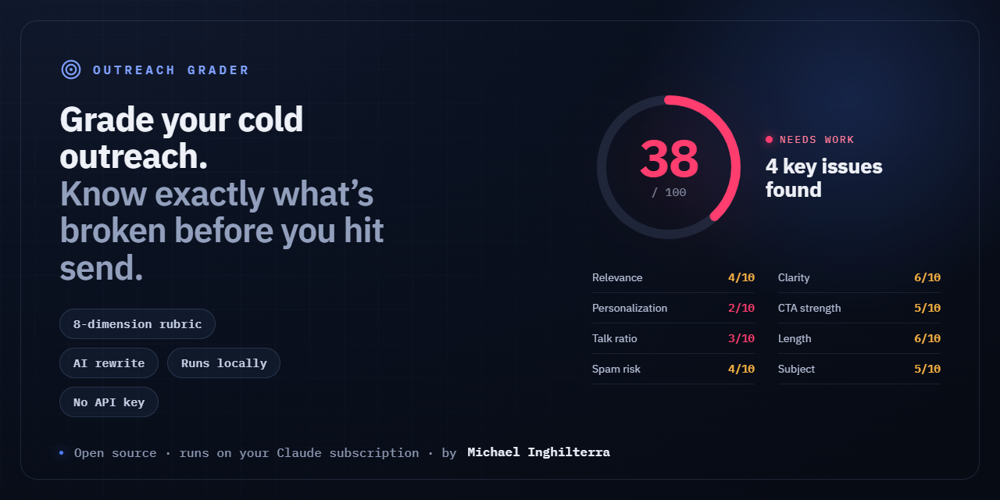
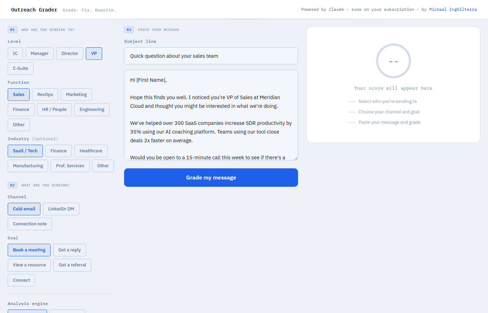
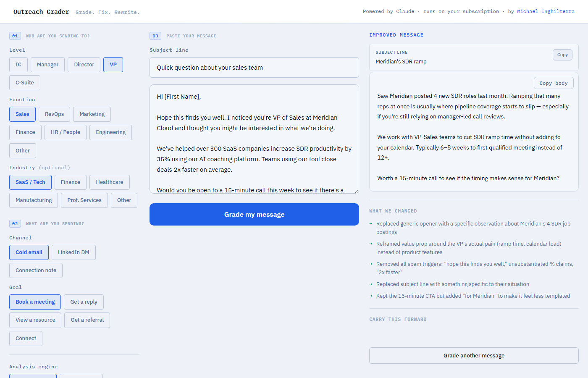

# Outreach Grader

**Paste your cold email or LinkedIn message. Get a score, specific fixes, and a rewrite — in seconds.**

Runs locally on your machine. Claude calls go through your own Claude subscription (the same one you use for Claude Code). No API key. No extra cost.



---

## The problem it solves

You spent 20 minutes on a cold email. You thought it was good. You sent it. Silence.

Most outreach fails for the same 4-5 reasons — a generic opener, a product-centric body, a weak subject line, a CTA that asks for too much. But you can't see these problems from the inside.

Outreach Grader puts your message through the same rubric a seasoned SDR leader would use: 8 dimensions, each scored 1-10, with specific callouts tied to your actual words. Then it rewrites the message based on what it found.

---

## What it looks like

**Step 1 — Tell it who you're writing to and what you're sending.**

Pick the recipient's level (IC → C-Suite), function, channel, and goal. The tool adjusts the rubric based on context: a cold email to a CFO is graded differently than a LinkedIn connection note to an SDR.



**Step 2 — Grade your message.**

You get an overall score (1-100), a one-line verdict, and 8 dimension scores with explanations that quote your actual words. No generic advice. Every note is tied to something specific you wrote.

**Step 3 — Rewrite.**

Click "Rewrite this for me." The tool fixes every issue it found, respects the channel's length norms, and gives you a breakdown of what changed and why.



---

## Prerequisites

- **Claude Code CLI** installed and logged in (`claude login`)
- Node.js 18+

That's it. No Anthropic API key. The grader runs every AI call through `claude -p`, which bills your existing Claude subscription (Max or Pro).

---

## Quick start

```bash
git clone https://github.com/michaelinghilterra-creator/outreach-grader.git
cd outreach-grader
npm install
node server.mjs
```

Open [http://localhost:3000](http://localhost:3000).

---

## How it works

The scoring rubric is built around 8 dimensions, each weighted differently:

| Dimension | Weight | What it checks |
|---|---|---|
| Relevance to recipient | 20% | Does the message speak to their level (IC vs. C-Suite) and function (Sales vs. Engineering)? |
| Personalization | 20% | Did you actually research this person, or just name-drop the company? |
| Talk-about-them ratio | 15% | Count of recipient sentences vs. sender sentences |
| Clarity | 15% | Is the value prop in the first two sentences? |
| CTA strength | 10% | Is the ask specific, low-friction, and matched to the relationship stage? |
| Length / readability | 10% | Channel norms: 300 chars for connection notes, 50-150 words for cold email |
| Spam risk | 10% | Trigger phrases, unsubstantiated claims, automation tells |
| Subject line | 10%* | Open-worthy, specific, no spam triggers (*cold email only; adjusts other weights) |

For the rewrite, the tool passes the dimension scores and top fixes back to Claude as context, then asks it to fix every issue while keeping your core message and any genuine personalization.

AI-generated text runs through [`ai-text-hygiene`](https://github.com/michaelinghilterra-creator/ai-text-hygiene) before it reaches you, stripping the hedging and filler patterns that make rewrites sound like they were written by a robot.

---

## Engine picker

By default the tool uses **Claude Sonnet** (fast, great for everyday outreach). Switch to **Opus** in the Analysis engine selector for high-stakes messages — a big deal, an executive cold outreach, a hard-to-get intro. Opus thinks longer and usually produces tighter feedback.

---

## Tips

- **Score under 50?** Don't send. Use the rewrite, then grade it again. Most rewrites land 20-30 points higher.
- **Channel matters.** A LinkedIn connection note and a cold email need completely different openers, length, and CTA weight. Set the channel before grading.
- **The "Talk-About-Them Ratio" is the most commonly failed dimension.** If your first two sentences start with "I" or "We," you're already in the hole.
- **Rate limit:** 20 grades/rewrites per hour per IP. More than enough for a working session.

---

## Built with

- [Node.js](https://nodejs.org) + [Express 5](https://expressjs.com)
- [Claude Code CLI](https://claude.ai/code) — AI calls run on your subscription, no API key needed
- [`ai-text-hygiene`](https://github.com/michaelinghilterra-creator/ai-text-hygiene) — strips AI tells from rewrites
- Vanilla HTML, CSS, JS — no build step, no framework

---

Built by [Michael Inghilterra](https://linkedin.com/in/michaelinghilterra)
